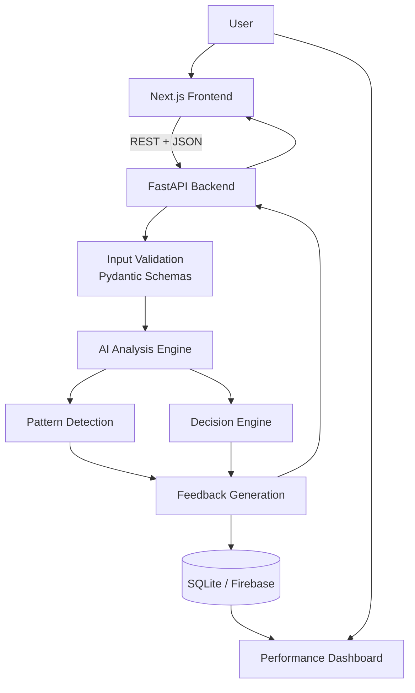
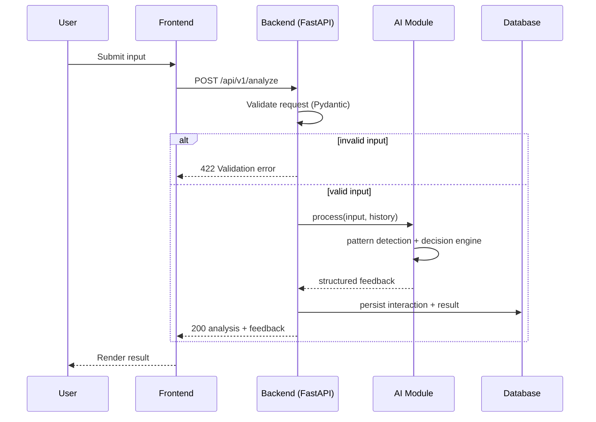
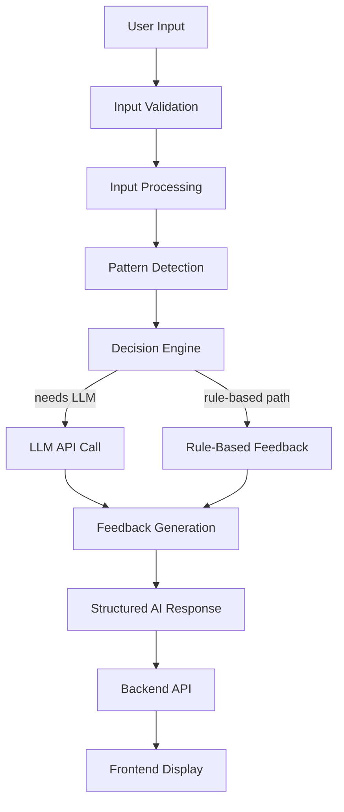
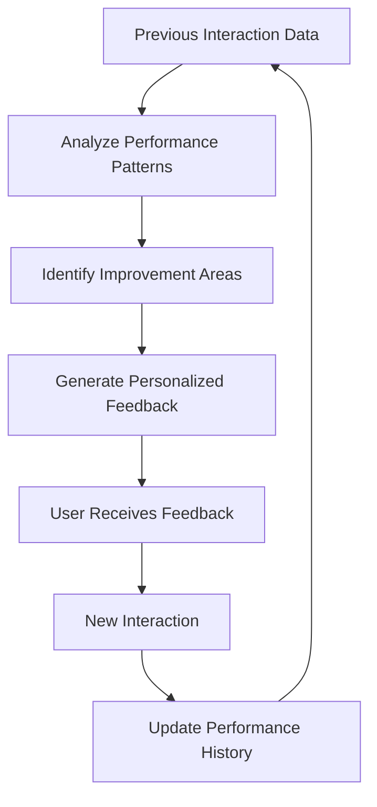

# AI Penfight — System Architecture

[](https://nextjs.org/)
[](https://www.typescriptlang.org/)
[](https://fastapi.tiangolo.com/)
[](https://www.python.org/)

> **Status:** Draft / Proposed architecture. Interfaces, schemas, and stack choices are expected to evolve during implementation — see [§14 Open Questions](#14-open-questions--decisions-needed).

---

## Table of Contents

1. [System Overview](#1-system-overview)
2. [Tech Stack](#2-tech-stack)
3. [Repository Layout](#3-repository-layout)
4. [Frontend Module](#4-frontend-module)
5. [Backend Module](#5-backend-module)
6. [AI Module](#6-ai-module)
7. [Database Module](#7-database-module)
8. [Adaptive Feedback Mechanism](#8-adaptive-feedback-mechanism)
9. [Security & Privacy](#9-security--privacy)
10. [Observability](#10-observability)
11. [Evaluation and Testing](#11-evaluation-and-testing)
12. [Deployment and Environment Variables](#12-deployment-and-environment-variables)
13. [Build Order](#13-build-order)
14. [Open Questions / Decisions Needed](#14-open-questions--decisions-needed)
15. [Future Enhancements](#15-future-enhancements)
16. [Conclusion](#16-conclusion)

---

## 1. System Overview

**AI Penfight** is an AI-powered analysis and feedback system. It takes free-form user input, runs it through an LLM-backed analysis pipeline, detects patterns against the user's history, and returns structured, actionable feedback — while tracking performance over time so future feedback gets more personalized.

The system is split into four independently deployable layers:

| Layer | Responsibility |
|---|---|
| **Frontend** | Collects input, renders analysis/feedback, visualizes progress |
| **Backend (API)** | Validates requests, orchestrates AI calls, persists data, enforces auth/rate limits |
| **AI Engine** | Processes input, detects patterns, generates feedback |
| **Data Layer** | Stores interactions, analysis results, and performance history |

### Core Capabilities

- Intelligent input analysis
- AI-powered, structured response generation
- Real-time feedback with graceful degradation if the LLM is slow/unavailable
- Adaptive recommendations based on interaction history
- Performance tracking and visualization

### System Architecture



### Architectural Principles

- **Modular design** — each component owns one responsibility and exposes a narrow interface to its neighbors.
- **AI-assisted, not AI-dependent** — the decision engine falls back to rule-based logic if the LLM call fails or times out, so the app degrades rather than breaks.
- **User-centered design** — feedback is written in plain language, not raw model output.
- **Adaptive feedback** — prior performance informs (but does not solely determine) future recommendations.
- **Data privacy by default** — least-privilege access, no PII in logs, encryption at rest/in transit.
- **Independent scalability** — frontend, backend, and AI processing scale and deploy separately.

---

## 2. Tech Stack

| Layer | Technology | Purpose |
|---|---|---|
| Frontend | Next.js, React, TypeScript | UI and application routing |
| Styling | Tailwind CSS, shadcn/ui | Consistent, responsive design system |
| API | FastAPI, Uvicorn, Pydantic | Endpoints, validation, async I/O |
| AI Processing | Python, LLM API (e.g., Claude via Anthropic API) | Input analysis and feedback generation |
| Data Processing | Python, pandas | Aggregation and analysis for performance metrics |
| Database | SQLite (prototype) → PostgreSQL / Firebase (production) | Interaction and performance history |
| Charts | Recharts | Performance visualization |
| Frontend Hosting | Vercel | Frontend deployment + preview environments |
| Backend Hosting | Render | API deployment |
| CI/CD | GitHub Actions | Lint, test, and deploy on push/PR |
| Testing | pytest, Vitest, Playwright (optional, e2e) | Backend, frontend, and integration testing |
| Collaboration | GitHub | Version control, issues, docs |

> **Note:** SQLite is fine for a single-instance prototype but does not support concurrent writes well under load. Plan the migration path to PostgreSQL (e.g., via Supabase or Render's managed Postgres) before multi-user production use — see [§14](#14-open-questions--decisions-needed).

---

## 3. Repository Layout

```text
AI-Penfight/
│
├── README.md
├── ARCHITECTURE.md
├── CONTRIBUTING.md
├── LICENSE
├── .gitignore
│
├── docs/
│   ├── api-contract.md
│   ├── project-workflow.md
│   └── screenshots/
│
├── frontend/
│   ├── app/
│   │   ├── layout.tsx
│   │   ├── page.tsx
│   │   ├── analysis/page.tsx
│   │   ├── history/page.tsx
│   │   └── dashboard/page.tsx
│   ├── components/
│   │   ├── layout/
│   │   ├── input/
│   │   ├── analysis/
│   │   ├── feedback/
│   │   └── dashboard/
│   ├── lib/
│   │   ├── api.ts
│   │   ├── types.ts
│   │   └── constants.ts
│   ├── package.json
│   └── .env.example
│
├── backend/
│   ├── app/
│   │   ├── main.py
│   │   ├── config.py
│   │   ├── schemas.py
│   │   ├── routers/
│   │   │   ├── analysis.py
│   │   │   ├── feedback.py
│   │   │   ├── history.py
│   │   │   └── performance.py
│   │   ├── services/
│   │   │   ├── analysis_service.py
│   │   │   ├── feedback_service.py
│   │   │   └── performance_service.py
│   │   └── core/
│   │       ├── security.py
│   │       ├── errors.py
│   │       ├── rate_limit.py
│   │       └── logging.py
│   ├── requirements.txt
│   └── .env.example
│
├── ai/
│   ├── input_processing.py
│   ├── pattern_detection.py
│   ├── decision_engine.py
│   ├── feedback_generation.py
│   ├── prompts/
│   │   └── feedback_prompt.md
│   └── evaluation.py
│
├── database/
│   ├── models.py
│   ├── database.py
│   ├── schemas.py
│   └── migrations/
│
├── tests/
│   ├── backend/
│   ├── ai/
│   ├── frontend/
│   └── integration/
│
├── .github/
│   └── workflows/
│       ├── backend-ci.yml
│       └── frontend-ci.yml
│
└── scripts/
    └── setup.py
```

**Changes from the original layout:** added `docs/api-contract.md` alignment, `ai/prompts/` to version-control LLM prompts (critical for reproducibility), `database/migrations/`, and `.github/workflows/` for CI/CD.

---

## 4. Frontend Module

### Main Pages

| Page | Responsibility |
|---|---|
| Home | Introduction and navigation |
| Analysis | Accept input, show live analysis |
| Feedback | Display AI-generated suggestions |
| History | Show past interactions |
| Dashboard | Visualize performance and progress |

### Responsibilities

- Validate input client-side (length, required fields) before submission — this is a UX optimization, not a security boundary; the backend re-validates everything.
- Route all network calls through a single typed API client (`lib/api.ts`) so headers, base URL, and error handling live in one place.
- Render loading, empty, and error states explicitly for every async view.
- Cache/display interaction history and performance stats.
- Be responsive down to mobile widths; charts should scroll horizontally rather than overflow the page.

### Suggested `lib/api.ts` contract

```typescript
export interface AnalyzeRequest {
  input: string;
  mode: "analysis" | "feedback";
}

export interface AnalyzeResponse {
  success: boolean;
  analysisId: string;
  analysis: string;
  feedback: string;
  recommendations: string[];
  createdAt: string;
}

export async function analyze(payload: AnalyzeRequest): Promise<AnalyzeResponse> {
  const res = await fetch(`${process.env.NEXT_PUBLIC_API_URL}/api/analyze`, {
    method: "POST",
    headers: { "Content-Type": "application/json" },
    body: JSON.stringify(payload),
  });
  if (!res.ok) throw await res.json();
  return res.json();
}
```

---

## 5. Backend Module

The backend is the single point of coordination between frontend, AI engine, and database. The frontend never calls the LLM directly — this keeps API keys server-side and lets the backend apply validation, rate limiting, and caching uniformly.

### Responsibilities

- Validate all incoming requests with Pydantic (reject early, cheaply).
- Orchestrate calls to the AI module; apply timeouts and retries with backoff.
- Persist interactions, analysis, and feedback.
- Return structured, versioned responses.
- Handle and classify errors (client error vs. upstream/LLM error vs. server error).
- Enforce authentication (if enabled) and per-user rate limits.
- Never log raw user input or API keys.

### API Contract

Base path: `/api/v1` (versioned — see [§14](#14-open-questions--decisions-needed) on auth/versioning decisions).

| Method | Endpoint | Purpose |
|---|---|---|
| POST | `/api/v1/analyze` | Submit input for AI analysis |
| POST | `/api/v1/feedback` | Generate/refresh feedback for an existing analysis |
| GET | `/api/v1/history?limit=&cursor=` | Retrieve paginated past interactions |
| GET | `/api/v1/performance` | Retrieve aggregated performance statistics |
| GET | `/api/v1/health` | Liveness/readiness check |

**Request — `POST /api/v1/analyze`**

```json
{
  "input": "Sample user input",
  "mode": "analysis"
}
```

**Response — success (200)**

```json
{
  "success": true,
  "analysisId": "an_9f2c1a",
  "analysis": "Analysis result",
  "feedback": "Suggested improvements",
  "recommendations": ["Recommendation 1", "Recommendation 2"],
  "createdAt": "2026-09-27T10:15:00Z"
}
```

**Response — validation error (422)**

```json
{
  "success": false,
  "error": {
    "code": "VALIDATION_ERROR",
    "message": "Field 'input' must not be empty."
  }
}
```

**Response — upstream AI failure (503)**

```json
{
  "success": false,
  "error": {
    "code": "AI_SERVICE_UNAVAILABLE",
    "message": "Analysis service is temporarily unavailable. Please try again shortly."
  }
}
```

> These are still illustrative — finalize exact field names and error codes in `docs/api-contract.md` before the frontend and backend are built in parallel, so both sides implement against the same contract.

### Request Sequence



---

## 6. AI Module

The AI module processes input, detects patterns, and produces feedback. It is designed to be model-agnostic: the LLM client is isolated behind a thin interface so the underlying provider/model can be swapped without touching the rest of the pipeline.

```text
ai/
├── input_processing.py
├── pattern_detection.py
├── decision_engine.py
├── feedback_generation.py
├── prompts/
│   └── feedback_prompt.md
└── evaluation.py
```

### 6.1 Input Processing
- Accept raw input from the backend.
- Clean and normalize (whitespace, encoding, length limits).
- Convert to the structured format the pattern detector and LLM prompt expect.

**Output:** processed input object.

### 6.2 Pattern Detection
- Identify recurring patterns/errors in the current input.
- Pull relevant prior interactions (bounded window, not full history, to control token cost).
- Produce feature signals for the decision engine (e.g., "repeated grammar issue," "improving trend on X").

**Output:** pattern features.

### 6.3 Decision Engine
- Combine pattern features with predefined rules to choose an analysis strategy.
- Decide when to call the LLM vs. when a rule-based response suffices (cost/latency optimization).
- Apply guardrails (e.g., reject or flag clearly malicious/off-topic input before it reaches the LLM).

### 6.4 Feedback Generation
- Generate the LLM prompt from processed input + pattern features + a bounded slice of performance history.
- Parse and validate the LLM's structured output (e.g., enforce JSON schema; retry once on malformed output).
- Return feedback + recommendations to the backend in the agreed response shape.

### AI Processing Flow



### Prompt Management

- Store prompts as versioned files under `ai/prompts/`, not as inline strings — this makes prompt changes reviewable in PRs and testable independently of code changes.
- Log the prompt *version* (not the raw user content) alongside each response for reproducibility and debugging.
- Set explicit `max_tokens`, timeouts, and a retry policy for every LLM call.

---

## 7. Database Module

### Proposed Data Entities

| Entity | Stored Information |
|---|---|
| User | User ID, preferences, created_at |
| Interaction | Input (or reference), timestamp, session ID, mode |
| Analysis | Analysis result, model/prompt version, metadata |
| Feedback | Suggestions, recommendations, linked analysis ID |
| Performance | Historical metrics, trend data, progress records |

### Responsibilities
- Store interaction history with enough metadata to reconstruct "what the user saw and when."
- Retrieve previous analyses efficiently (indexed by user + timestamp).
- Maintain performance aggregates without recomputing from scratch on every dashboard load (consider a materialized/rollup table).
- Support personalized feedback lookups.
- Enforce access control so a user can only read their own records.

**SQLite** is reasonable for the initial prototype (single-writer, file-based, zero setup). For anything beyond a solo demo, migrate to **PostgreSQL** or **Firebase** — SQLite's single-writer lock will bottleneck concurrent analysis requests.

---

## 8. Adaptive Feedback Mechanism



### Working
1. Store the results of each interaction.
2. Analyze available performance records (bounded to a recent window for cost/relevance).
3. Identify repeated mistakes or improvement areas.
4. Generate recommendations tailored to the user's actual history.
5. Record new results to inform the next cycle.

Initial adaptation uses stored history plus predefined rules. Automatic model retraining is explicitly out of scope for v1 — this is a data/analytics feature, not an ML training pipeline.

---

## 9. Security & Privacy

- **Secrets:** `AI_API_KEY`, `DATABASE_URL`, and any auth secrets live only in environment variables / the hosting provider's secret manager — never in git.
- **Transport:** HTTPS everywhere in production (Vercel and Render provide this by default).
- **CORS:** Restrict `allow_origins` to the deployed frontend domain(s); never use `*` once real user data is involved.
- **Input handling:** Treat all user input as untrusted — validate length/type server-side regardless of client-side checks, and never interpolate raw user input directly into prompts without a clear delimiter (to reduce prompt-injection risk against the decision engine).
- **PII minimization:** Avoid storing more than necessary; if raw user input must be retained for history, document retention policy and provide a deletion path.
- **Logging:** Structured logs should exclude raw input content and secrets; log request IDs, not payloads.
- **Auth:** Not yet specified in this draft — decide before multi-user launch (see [§14](#14-open-questions--decisions-needed)).

---

## 10. Observability

- **Health checks:** `/api/v1/health` should check DB connectivity and (optionally) a lightweight LLM ping, returning per-dependency status.
- **Structured logging:** JSON logs with request ID, route, latency, and status code; ship to Render's log stream or an external sink (e.g., Better Stack, Axiom) once beyond prototype scale.
- **Metrics to track:** request latency (p50/p95), LLM call latency and error rate, validation error rate, and daily active users.
- **Alerting:** Start simple — alert on elevated 5xx rate or LLM error rate; expand as usage grows.

---

## 11. Evaluation and Testing

### Evaluation Metrics

| Metric | Purpose |
|---|---|
| Accuracy | Correctness against verified reference results |
| Response Time | Time to generate a response (target: define an SLO, e.g., p95 < 3s) |
| Relevance | Whether feedback matches the input |
| Adaptability | Whether recommendations reflect performance history |
| Robustness | Behavior under invalid/adversarial input |
| Usability | Ease of interaction (qualitative/user testing) |

### Testing Structure

```text
tests/
├── backend/
│   ├── test_analysis.py
│   ├── test_feedback.py
│   └── test_api.py
├── ai/
│   ├── test_input_processing.py
│   ├── test_pattern_detection.py
│   └── test_feedback_generation.py
├── frontend/
│   └── test_user_interface.tsx
└── integration/
    └── test_analysis_flow.py
```

### Test Scenarios

| Scenario | Expected Behavior |
|---|---|
| Valid input | AI analysis is generated |
| Empty input | Validation error is returned |
| Invalid input (wrong type/oversized) | System returns a clear, structured error |
| AI service unavailable/timeout | Graceful failure message; no crash |
| Malformed LLM output | Backend catches parse failure, retries once, then falls back gracefully |
| Repeated interactions | Previous history is retrieved correctly and paginated |
| Database unavailable | Error handled without crashing; user sees a friendly message |
| Concurrent requests (load test) | No data corruption; acceptable latency degradation |

**CI:** Run `pytest` and `Vitest` on every PR via GitHub Actions; block merges on failing tests or lint errors.

---

## 12. Deployment and Environment Variables

### Proposed Deployment

```text
Frontend:
  Next.js application
  Hosted on Vercel (with preview deployments per PR)

Backend:
  FastAPI application
  Hosted on Render

AI:
  External LLM API (e.g., Anthropic API)

Database:
  SQLite for prototype
  PostgreSQL or Firebase for production
```

### Environment Variables

**Frontend (`frontend/.env.example`)**
```text
NEXT_PUBLIC_API_URL=http://localhost:8000
```

**Backend (`backend/.env.example`)**
```text
AI_API_KEY=<your-api-key>
DATABASE_URL=<your-database-url>
ALLOWED_ORIGINS=http://localhost:3000
ENVIRONMENT=development
LOG_LEVEL=info
```

### Deployment Checklist
- [ ] Keep all secrets in environment variables; never commit `.env` files.
- [ ] Restrict CORS to approved frontend origin(s).
- [ ] Validate every request server-side, independent of frontend checks.
- [ ] Set sane request timeouts on all outbound LLM calls.
- [ ] Test both local and deployed configurations before merging to `main`.
- [ ] Confirm database migration path before enabling multi-user access.

---

## 13. Build Order

1. Scaffold frontend and backend project structures.
2. Build the input UI and a minimal dashboard shell.
3. Implement FastAPI endpoints with request/response validation (stub AI responses first).
4. Integrate the real AI module for analysis and feedback.
5. Add database storage and interaction history.
6. Implement performance tracking and the adaptive feedback loop.
7. Add automated tests and structured error handling across all layers.
8. Set up CI (lint + test) and deploy frontend/backend.
9. Verify the complete end-to-end user workflow in the deployed environment.
10. Add observability (logging, health checks, basic alerting) before onboarding real users.

---

## 14. Open Questions / Decisions Needed

These aren't blockers for starting development, but should be resolved before production launch:

- **Authentication:** Anonymous/session-based, or full user accounts (e.g., NextAuth + JWT)?
- **Database choice:** Commit to SQLite→Postgres migration timeline, or start on Postgres/Firebase directly?
- **LLM provider/model:** Which model, and what's the fallback if the primary provider has an outage?
- **Rate limiting:** Per-IP, per-user, or both? What are the limits?
- **Data retention:** How long is raw user input stored, and can users request deletion?

---

## 15. Future Enhancements

- Voice-based input and feedback.
- More advanced AI models / multi-model ensembling.
- Real-time collaborative features.
- Deeper personalization (e.g., learning-style-aware feedback).
- Advanced performance analytics and trend forecasting.
- Native mobile application support.

---

## 16. Conclusion

AI Penfight's architecture separates user interaction, backend orchestration, AI analysis, and data management into independently deployable, independently testable modules. This document should be treated as a living reference: update it as schemas, auth, and infrastructure decisions are finalized during implementation, and keep `docs/api-contract.md` in sync with whatever the backend actually ships.
